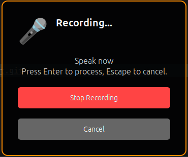

# GNOME Speech2Text


Local speech-to-text for GNOME Shell using [whisper.cpp](https://github.com/ggerganov/whisper.cpp). Record audio with a keyboard shortcut, transcribe it locally, and insert the text at your cursor or copy to clipboard.

> **Fork Notice**: This is a fork of [kavehtehrani/gnome-speech2text](https://github.com/kavehtehrani/gnome-speech2text) modified to work with whisper.cpp server for blazing-fast local transcription. The main advantage is speed and flexibility - you can tweak whisper.cpp settings, choose different models, and enjoy significantly faster inference compared to Python-based solutions.



## Features

- **Fast & Local** - Uses whisper.cpp server for blazing-fast C++ inference (no cloud APIs, much faster than Python implementations)
- **Highly Customizable** - Choose different Whisper models (tiny to large), configure VAD, set language preferences
- **Quick Access** - Panel button + keyboard shortcut (default: Super+Alt+Space)
- **Multi-language** - Supports all languages available in Whisper models
- **Text Insertion** - Automatically insert at cursor (X11) or copy to clipboard (Wayland)
- **Voice Activity Detection** - Optional VAD filtering to reduce hallucinations

## Quick Start

### 1. Install System Dependencies

**Ubuntu/Debian:**

```bash
sudo apt install python3 pipx ffmpeg python3-dbus python3-gi wl-clipboard xdotool xclip
```

**Fedora:**

```bash
sudo dnf install python3 pipx ffmpeg python3-dbus python3-gobject wl-clipboard xdotool xclip
```

### 2. Set Up whisper.cpp Server

This extension requires a [whisper.cpp](https://github.com/ggerganov/whisper.cpp) server with models in `~/.cache/whisper.cpp/`.

**Quick setup:**

```bash
# Build whisper.cpp server
git clone https://github.com/ggerganov/whisper.cpp
cd whisper.cpp
make server

# Download models (e.g., 'base' model)
bash ./models/download-ggml-model.sh base ~/.cache/whisper.cpp
```

For detailed whisper.cpp setup (including VAD models, GPU support, etc.), see [service-whispercpp/README.md](./service-whispercpp/README.md).

### 3. Install WhisperCpp Service

**From source (recommended):**

```bash
git clone https://github.com/bcelary/gnome-speech2text.git
cd gnome-speech2text/service-whispercpp
./install.sh --from-source
```

**Or quick curl install:**

```bash
curl -fsSL https://raw.githubusercontent.com/bcelary/gnome-speech2text/main/service-whispercpp/install.sh | bash
```

> **Note**: PyPI package coming soon. For now, install from source.

The service will auto-start the whisper.cpp server when needed.

### 4. Install Extension

**From source:**

```bash
git clone https://github.com/bcelary/gnome-speech2text.git
cd gnome-speech2text
make install
```

**Then restart GNOME Shell:**

- X11: Press `Alt+F2`, type `r`, press Enter
- Wayland: Log out and back in

## Configuration

Configure the whisper.cpp service via environment variables:

```bash
export WHISPER_MODEL="small"           # Model: tiny, base, small, medium, large-v3-turbo
export WHISPER_LANGUAGE="auto"         # Language: auto, en, es, fr, de, etc.
export WHISPER_VAD_MODEL="auto"        # VAD: auto (recommended), none, or specific model
export WHISPER_SERVER_URL="http://localhost:8080"  # Server URL
```

Add these to `~/.bashrc` or `~/.profile` to make them persistent.

### Extension Preferences

Right-click the microphone icon → Settings:

- **Keyboard Shortcut** - Customize recording hotkey
- **Recording Duration** - Max recording time (10-300 seconds)
- **Copy to Clipboard** - Auto-copy transcribed text
- **Skip Preview** (X11 only) - Insert text immediately without preview

## Usage

1. Press **Super+Alt+Space** (or click the microphone icon)
2. Speak when the recording dialog appears
3. Wait for transcription
4. Review and click **Insert** or **Copy**

## Troubleshooting

**Service not starting:**

```bash
# Check D-Bus registration
dbus-send --session --print-reply \
  --dest=org.gnome.Shell.Extensions.Speech2TextWhisperCpp \
  /org/gnome/Shell/Extensions/Speech2TextWhisperCpp \
  org.gnome.Shell.Extensions.Speech2TextWhisperCpp.GetServiceStatus

# View logs
journalctl -f | grep -E "(gnome-shell|speech2text|whispercpp)"
```

**Extension not appearing:**

```bash
# Verify installation
make status

# Check extension is enabled
gnome-extensions enable gnome-speech2text@bcelary.github
```

**Text insertion not working on Wayland:**
Text insertion requires X11. On Wayland, use "Copy to Clipboard" mode instead.

For more troubleshooting, see [service-whispercpp/README.md](./service-whispercpp/README.md).

## Development

```bash
# Install extension
make install

# Check status
make status

# View logs
journalctl -f | grep speech2text
```

**Service development**: See [service-whispercpp/README.md](./service-whispercpp/README.md) for detailed instructions on setting up the service in development mode with `uv`.

## Uninstallation

```bash
# Remove service
gnome-speech2text-whispercpp-uninstall
pipx uninstall gnome-speech2text-service-whispercpp

# Remove extension
make uninstall
```

## Architecture

The extension consists of two components:

1. **GNOME Extension** (UI) - Panel button, keyboard shortcuts, settings dialog
2. **D-Bus Service** (Backend) - Audio recording, speech transcription via whisper.cpp, text insertion

This separation follows GNOME's security guidelines and keeps the extension lightweight.

## Privacy

All audio processing happens locally on your machine. No data is sent to external servers.

## License

MIT License - see [LICENSE](LICENSE) file for details.

## Credits

- Forked from [kavehtehrani/gnome-speech2text](https://github.com/kavehtehrani/gnome-speech2text)
- Uses [whisper.cpp](https://github.com/ggerganov/whisper.cpp) for efficient local inference
- Based on OpenAI's [Whisper](https://github.com/openai/whisper) models

## Contributing

Issues and pull requests welcome at [github.com/bcelary/gnome-speech2text](https://github.com/bcelary/gnome-speech2text).
